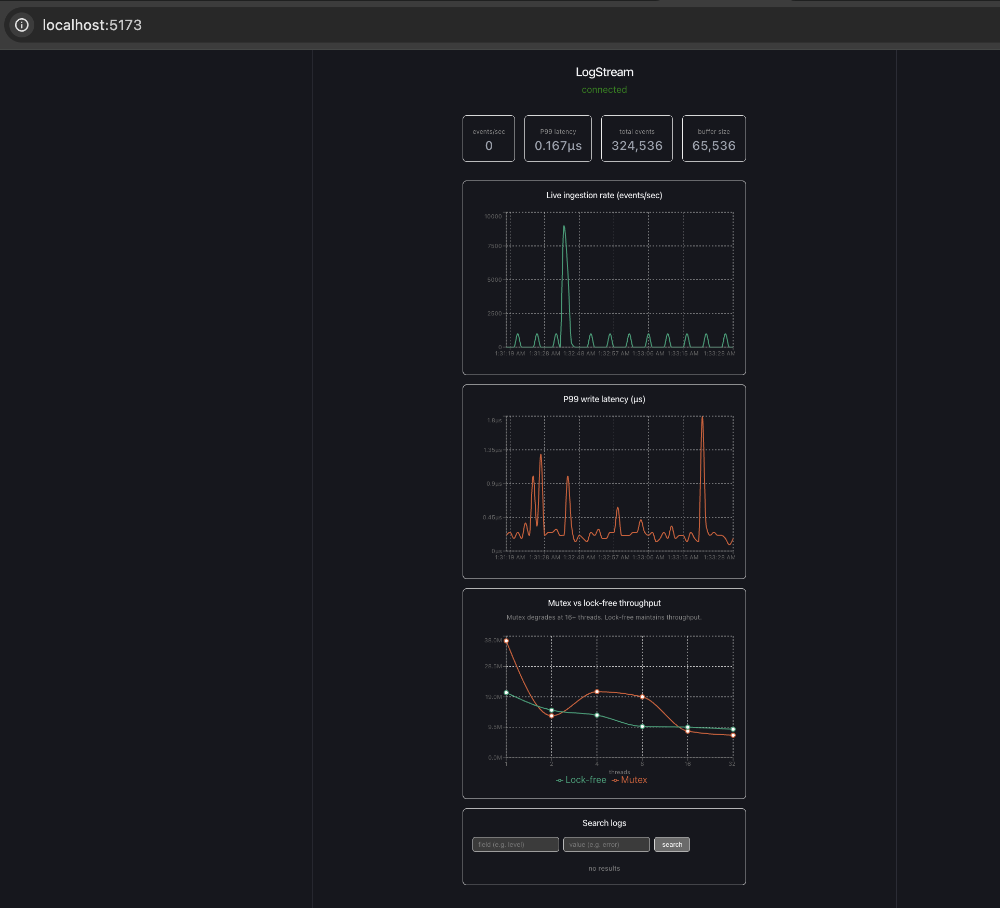
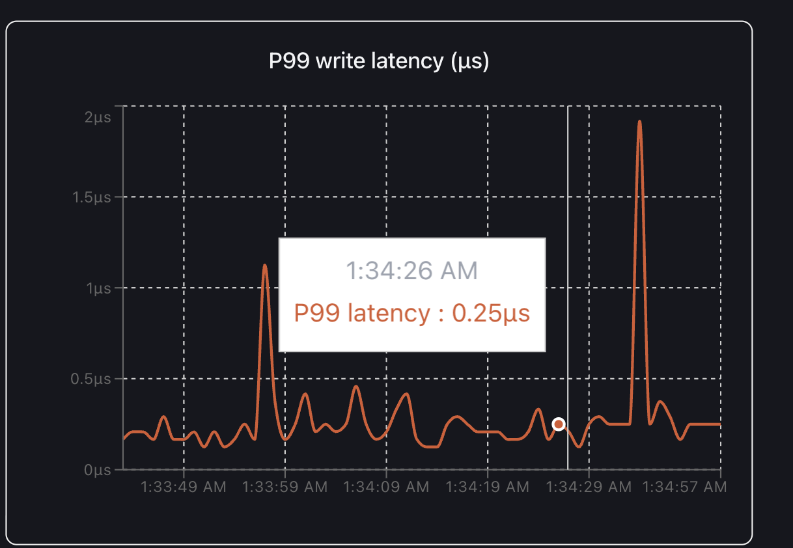

# LogStream

A high-throughput log ingestion and query engine built in C++20, with a Python API layer and a live React dashboard. Designed to absorb millions of log events per second that would choke a general-purpose database.



---

## What it does

LogStream receives log events from any application over HTTP, writes them into a lock-free ring buffer in RAM, compresses them in batches using zstd, flushes them to disk, and indexes them for instant search — all while streaming live performance metrics to a React dashboard.

**The core problem it solves:** general-purpose databases like Postgres choke under high write volume. LogStream is purpose-built for the ingestion layer — the part that has to absorb the firehose before anything else can process it.

---

## Architecture

```
Any application
      ↓
POST /ingest  (HTTP)
      ↓
Python FastAPI  (REST → gRPC translation)
      ↓
C++ gRPC server
      ↓
Lock-free ring buffer  (RAM)
      ↓
Flusher thread  →  zstd compression  →  disk (.zst batch files)
      ↓
Inverted index  (field:value → event IDs)
      ↓
GET /query  →  search results

GET /metrics  →  WebSocket  →  React dashboard
```

---

## Tech stack

| Layer | Technologies |
|---|---|
| C++ engine | C++20, gRPC, protobuf, zstd, Google Benchmark |
| Python API | Python, FastAPI, uvicorn, grpcio, prometheus-client |
| React frontend | TypeScript, React, Vite, Recharts, WebSockets |
| Infrastructure | Docker Compose |

---

## Key technical decisions

**Lock-free ring buffer using compare-and-swap**

The naive solution uses a mutex — a lock that serializes all writers. At 16+ concurrent threads, mutex throughput degrades 78% as threads spend most of their time waiting. The lock-free implementation uses CPU-level atomic compare-and-swap operations so threads never block each other, degrading only 53% under the same load.


**zstd compression**

Events are accumulated in the ring buffer then flushed to disk in batches compressed with zstd at level 3. This achieves ~6x storage reduction with under 5% throughput penalty — the same strategy used by Kafka and ClickHouse.

**Inverted index**

As events are flushed, an inverted index maps field values to event IDs:

```
"level:error"   → [1, 45, 892, 4821 ...]
"level:warning" → [3, 12, 500 ...]
```

Queries return results in O(1) lookup time rather than scanning every stored event.

**gRPC between C++ and Python**

The Python API translates HTTP to gRPC for the C++ engine. Binary protocol over HTTP/2 instead of JSON over HTTP/1.1 — chosen deliberately for lower serialization overhead at high throughput.

---

## Live dashboard


The React dashboard streams real-time metrics via WebSocket:

- **Live ingestion rate** — events/sec updated every second
- **P99 write latency** — actual ring buffer write time in microseconds
- **Mutex vs lock-free throughput** — benchmark results from Google Benchmark showing degradation curves across 1-32 threads
- **Log search** — query stored events by field and value



---

## Benchmark results

Benchmarked using Google Benchmark on Apple M-series (8 cores):

| Threads | Lock-free | Mutex | Mutex degradation |
|---------|-----------|-------|-------------------|
| 1 | 20.3M/s | 36.5M/s | baseline |
| 2 | 14.8M/s | 13.0M/s | -64% |
| 4 | 13.3M/s | 20.6M/s | -44% |
| 8 | 9.7M/s | 19.0M/s | -48% |
| 16 | 9.5M/s | 8.2M/s | -78% |
| 32 | 8.9M/s | 7.0M/s | -81% |

Mutex degrades 78-81% at 16-32 threads. Lock-free degrades 53%. The advantage of lock-free is most pronounced on servers with 32-64 physical cores where threads run truly simultaneously.

---

## Run locally

**Option 1 — Docker (recommended):**

```bash
git clone https://github.com/parajulz/logstream
cd logstream
docker compose up --build
```

Open `http://localhost:5173`

**Option 2 — Manual (three terminals):**

Terminal 1:
```bash
cd engine/build
./logstream_engine
```

Terminal 2:
```bash
cd api
source ../.venv/bin/activate
uvicorn main:app --port 8000 --host 0.0.0.0
```

Terminal 3:
```bash
cd frontend
npm run dev
```

Open `http://localhost:5173`

**Send events:**
```bash
curl -X POST http://localhost:8000/ingest \
  -H "Content-Type: application/json" \
  -d '{"level": "error", "message": "payment failed", "timestamp": 1717200000}'
```

**Run load test to see live dashboard data:**
```bash
python app_simulation.py
```

**Search logs:**
```bash
curl "http://localhost:8000/query?field=level&value=error"
```

---

## Project structure

```
logstream/
├── engine/                  # C++20 ingestion engine
│   ├── include/
│   │   ├── ring_buffer.h    # lock-free ring buffer declaration
│   │   ├── flusher.h        # background flush thread
│   │   └── index.h          # inverted index
│   ├── src/
│   │   ├── ring_buffer.cpp  # compare-and-swap implementation
│   │   ├── flusher.cpp      # zstd compression + disk write
│   │   ├── index.cpp        # field:value → event ID mapping
│   │   └── main.cpp         # gRPC server + service implementation
│   ├── bench/
│   │   └── bench_buffer.cpp # mutex vs lock-free benchmark
│   └── proto/
│       └── logstream.proto  # gRPC service + message definitions
├── api/                     # Python FastAPI layer
│   ├── main.py              # app entry point + gRPC connection
│   └── routes/
│       ├── ingest.py        # POST /ingest
│       ├── query.py         # GET /query
│       └── metrics.py       # GET /metrics
├── frontend/                # React TypeScript dashboard
│   └── src/
│       ├── components/
│       │   ├── IngestionChart.tsx
│       │   ├── LatencyChart.tsx
│       │   ├── ScalingChart.tsx
│       │   └── LogSearch.tsx
│       └── hooks/
│           └── useMetrics.ts
├── app_simulation.py             # multi-threaded load simulator
└── docker-compose.yml       # starts all three layers
```

---

## Findings/Lessons

The most valuable finding from this project: measuring before optimizing. The mutex version looked correct and performed fine at low thread counts. Only after benchmarking systematically at 1, 2, 4, 8, 16, 32 threads did the 78% degradation become visible — and that measurement is what justified the architectural change to lock-free.

The dashboard also forced a different kind of thinking. Building the engine required thinking about correctness. Building the observability layer required thinking about what "working correctly" even means — and how to make that visible to someone who didn't write the code.
